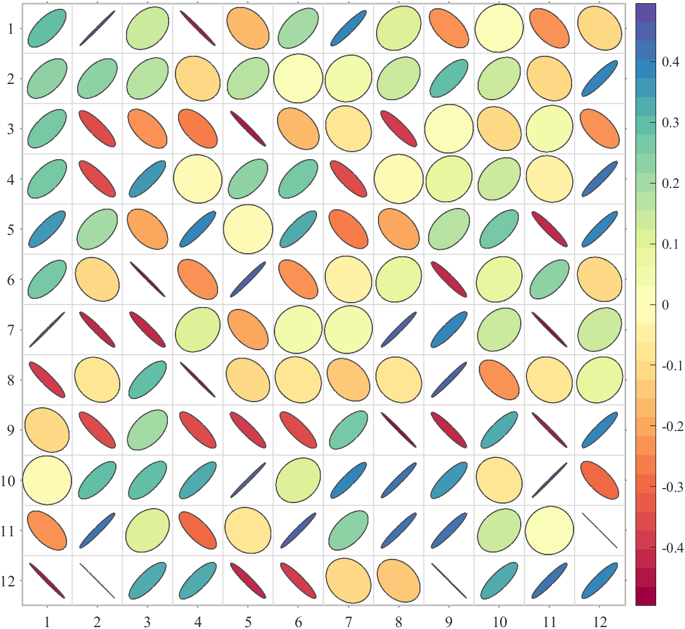
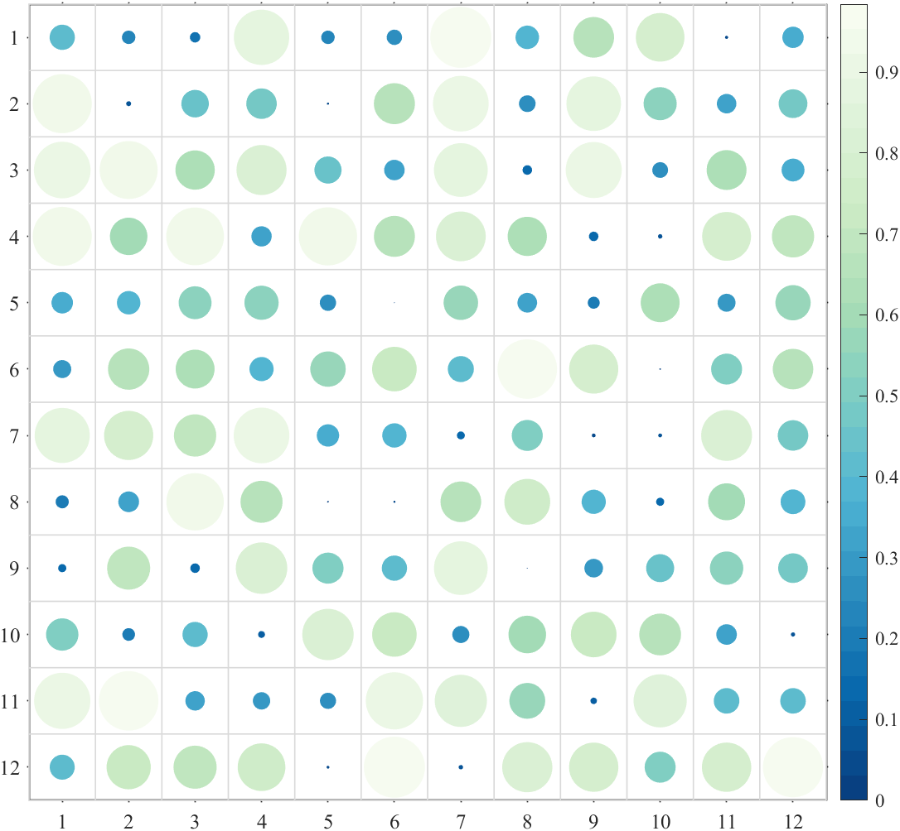

# MATLAB Special Heatmap

#### 介绍
Zhaoxu Liu / slandarer (2023). special heatmap (https://www.mathworks.com/matlabcentral/fileexchange/125520-special-heatmap), MATLAB Central File Exchange. 检索来源 2023/3/1.

#### 免登录网盘链接

链接：https://pan.baidu.com/s/13t5w0aVzCWebNwaFfWSlnw?pwd=slan \
提取码：slan 

### 1 基础使用(Basic use)
#### 1.1 非负矩阵(Draw positive heat map)

```matlab
figure()
Data=rand(15,15);
SHM1=SHeatmap(Data,'Format','sq');
SHM1=SHM1.draw();
```


#### 1.2 绘制有负数热图(Contains negative numbers)
```matlab
figure()
Data=rand(15,15)-.5;
SHM2=SHeatmap(Data,'Format','sq');
SHM2=SHM2.draw();
```


#### 1.3 绘制不同大小热图(Draw heat maps of different sizes)
```matlab
figure()
Data=rand(25,30);
SHM4=SHeatmap(Data,'Format','sq');
SHM4=SHM4.draw();
```


#### 1.4 调整colorbar位置(Adjust the colorbar Location)
```matlab
figure()
Data=rand(3,12);
SHM5=SHeatmap(Data,'Format','sq');
SHM5=SHM5.draw();
CB=colorbar;
CB.Location='southoutside';
```


#### 1.5 绘制有NaN热图(Draw heat map with NaN)
```matlab
figure()
Data=rand(12,12)-.5;
Data([4,5,13])=nan;
SHM6=SHeatmap(Data,'Format','sq');
SHM6=SHM6.draw();
```


#### 1.6 绘制有文本热图(Draw heat map with texts)

使用 setText() 方法显示文字：
Use the setText() method to display text:
```matlab
figure()
Data=rand(12,12)-.5;
Data([4,5,13])=nan;
SHM7=SHeatmap(Data,'Format','sq');
SHM7=SHM7.draw();
SHM7.setText();
```


#### 1.7 绘制带标签热图(Draw heat map with labels)

改x轴y轴标签就还是设置 XTickLabel 和 YTickLabel :
Change the x-axis and y-axis labels by setting XTickLabel and YTickLabel :
```matlab
figure()
Data=rand(12,12);
SHM8=SHeatmap(Data,'Format','sq');
SHM8=SHM8.draw(); 
ax=gca;
ax.XTickLabel={'X-1','X-2','X-3','X-4','X-5','X-6','X-7','X-8','X-9','X-10','X-11','X-12'};
ax.YTickLabel={'Y-1','Y-2','Y-3','Y-4','Y-5','Y-6','Y-7','Y-8','Y-9','Y-10','Y-11','Y-12'};
ax.FontSize=14;
```


### 各类型热图绘制(Preparation of various Format of heat maps)
+ sq    : square (default)     : 方形(默认)
+ pie   : pie chart                : 饼图   
+ circ  : circular                   : 圆形
+ oval  : oval                       : 椭圆形
+ hex   : hexagon                ：六边形
+ asq   : auto-size square   ：自带调整大小的方形
+ acirc : auto-size circular   ：自带调整大小的圆形

```matlab
% sq    : square (default)   : 方形(默认)
% pie   : pie chart          : 饼图   
% circ  : circular           : 圆形
% oval  : oval               : 椭圆形
% hex   : hexagon            ：六边形
% asq   : auto-size square   ：自带调整大小的方形
% acirc : auto-size circular ：自带调整大小的圆形

Format={'sq','pie','circ','oval','hex','asq','acirc'};
A=rand(12,12);
B=rand(12,12)-.5;

for i=1:length(Format)
    disp(['Format--',Format{i}])
    % 绘制纯正数热图(Draw positive heat map)
    figure();
    SHM_A=SHeatmap(A,'Format',Format{i});
    SHM_A=SHM_A.draw();
    % exportgraphics(gca,['Format_',Type{i},'_A.png']) % 存储图片

    % 绘制含负数热图(Draw heat map with negative number)
    figure();
    SHM_B=SHeatmap(B,'Format',Format{i});
    SHM_B=SHM_B.draw();
    % exportgraphics(gca,['Format_',Type{i},'_B.png']) % 存储图片
end
```








### 3 调整colormap(Adjust colormap)
#### 3.1 调整clim(Adjust clim)

使用 clim() 或者 caxis() 调整颜色映射范围
Use function clim() or caxis() to set the CLim
```matlab
fig=figure('Position',[50,50,1400,700]);
% random data
Data=rand(12,12)-.5;
Data([4,5,13])=nan;
% subplot1
ax1=axes('Parent',fig,'Position',[0+1/40,0,1/2-1/20,1]);
SHM_ax1=SHeatmap(Data,'Format','sq','Parent',ax1);
SHM_ax1=SHM_ax1.draw();
SHM_ax1.setText();
% subplot2 adjust clim
ax2=axes('Parent',fig,'Position',[1/2+1/40,0,1/2-1/20,1]);
SHM_ax2=SHeatmap(Data,'Format','sq','Parent',ax2);
SHM_ax2=SHM_ax2.draw();
clim([-.8,.8])
SHM_ax2.setText();
```


#### 3.2 使用MATLAB自带colormap(Use the built-in colormap in MATLAB)
```matlab
figure()
Data=rand(14,14);
SHM_Bone=SHeatmap(Data,'Format','sq');
SHM_Bone.draw();
colormap(bone)
```


#### 3.3 slanCM(slanCM colormap)
Zhaoxu Liu / slandarer (2023). 200 colormap (https://www.mathworks.com/matlabcentral/fileexchange/120088-200-colormap), MATLAB Central File Exchange. 检索来源 2023/3/15.
```matlab
% 单向colormap或离散colormap
for i=[20,21,61,177]
    figure()
    Data=rand(14,14);
    SHM_slan=SHeatmap(Data,'Format','sq');
    SHM_slan.draw();
    colormap(slanCM(i))
    exportgraphics(gca,['gallery\Colormap_slanCM_',num2str(i),'.png'])
end
% 双向colormap(Diverging colormap)
for i=[141,136,134]
    figure()
    Data=rand(14,14)-.5;
    SHM_slan=SHeatmap(Data,'Format','sq');
    SHM_slan=SHM_slan.draw();
    clim([-.7,.7])
    colormap(slanCM(i))
    SHM_slan.setText();
    exportgraphics(gca,['gallery\Colormap_slanCM_',num2str(i),'.png'])
end
```


### 4 整体修饰(Overall decoration)

setBox   ：修饰边框
setPatch ：修饰图形
setText  ：修饰文本
```matlab
figure()
Data=rand(10,10);

SHM=SHeatmap(Data,'Format','pie');
SHM=SHM.draw(); 
% 容器边框设置为蓝色
% 图形边框设置为红色
% The container box border is set to blue
% The drawing border is set to red
SHM.setBox('Color',[0,0,.8])
SHM.setPatch('EdgeColor',[.8,0,0])


figure()
Data=rand(10,10);
Data([4,5,13])=nan;

SHM=SHeatmap(Data,'Format','sq');
SHM=SHM.draw(); 
% 设置文本为蓝色并修改字号
% Set the text to blue and modify the font size
SHM.setText('Color',[0,0,.8],'FontSize',14)
```


### 5 局部修饰(Partial decoration)

setTextMN
setPatchMN
设置第m行n列对象的属性：举个例子，把数值大于0.9部分文字变为星号，并用红色框框起来，并改编NaN处颜色。

Set the attributes of the object in row m and column n: for example, change the text with a value greater than 0.9 into an asterisk, frame it in red, and adapt the color at NaN.
```matlab
figure()
Data=rand(9,9);
Data([4,5,13])=nan;
% 绘制方块形状热图
SHM=SHeatmap(Data,'Format','sq');
SHM=SHM.draw();
% 显示文本(Show Text)
SHM.setText(); 
for i=1:size(Data,1)
    for j=1:size(Data,2)
        if Data(i,j)>=.9
            SHM.setTextMN(i,j,'String','**','FontSize',20)         % 修改>=0.9方块颜色
            SHM.setPatchMN(i,j,'EdgeColor',[1,0,0],'LineWidth',2)  % 修改>=0.9方块文本为**
        end
        if isnan(Data(i,j))
            SHM.setPatchMN(i,j,'FaceColor',[.8,.6,.6]) % 修改NaN处颜色
        end
    end
end
```


### 6 设置为上三角或下三角(Set to upper triangle or lower triangle)
#### 6.1 上下三角格式(upper triangle or lower triangle)
```matlab
% 随便捏造了点数据(Made up some data casually)
X=randn(20,15)+[(linspace(-1,2.5,20)').*ones(1,6),(linspace(.5,-.7,20)').*ones(1,5),(linspace(.9,-.2,20)').*ones(1,4)];
% 求相关系数矩阵(Get the correlation matrix)
Data=corr(X);

% + 'triu'   : upper triangle                  : 上三角部分
% + 'tril'   : lower triangle                  : 下三角部分
% + 'triu0'  : upper triangle without diagonal : 扣除对角线上三角部分
% + 'tril0'  : lower triangle without diagonal : 扣除对角线下三角部分

Type={'triu','tril','triu0','tril0'};
for i=1:length(Type)
    figure()
    SHM_s1=SHeatmap(Data,'Format','sq');
    SHM_s1=SHM_s1.draw();
    SHM_s1.setText();
    % 设置格式(set Type)
    SHM_s1.setType(Type{i});
%     exportgraphics(gca,['gallery\Type_',Type{i},'.png'])
end
```


#### 6.2 设置标签名称(set variable labels' String)
```matlab
% 随便捏造了点数据(Made up some data casually)
X=randn(20,15)+[(linspace(-1,2.5,20)').*ones(1,6),(linspace(.5,-.7,20)').*ones(1,5),(linspace(.9,-.2,20)').*ones(1,4)];
% 求相关系数矩阵(Get the correlation matrix)
Data=corr(X);

figure()
SHM_s2=SHeatmap(Data,'Format','sq');
SHM_s2=SHM_s2.draw();
SHM_s2.setType('tril');

varName={'A1','A2','A3','A4','A5','B1','B2','B3','B4','B5','C1','C2','C3','C4','C5'};
SHM_s2.setVarName(varName)
% exportgraphics(gca,'gallery\Type_labels.png')
```


#### 6.3 调整轴范围以避免遮挡(Adjust the axis Limit to avoid occlusion)
```matlab
% 随便捏造了点数据(Made up some data casually)
X=randn(20,15)+[(linspace(-1,2.5,20)').*ones(1,6),(linspace(.5,-.7,20)').*ones(1,5),(linspace(.9,-.2,20)').*ones(1,4)];
% 求相关系数矩阵(Get the correlation matrix)
Data=corr(X);

figure()
SHM_s3=SHeatmap(Data,'Format','pie');
SHM_s3=SHM_s3.draw();
SHM_s3.setType('tril');
SHM_s3.setVarName({'Slandarer'})
ax=gca;
ax.XLim(2)=ax.XLim(2)+1;
```


#### 6.4 展示所有样式的上三角化(show upper triangle of all formats)
```matlab
% 随便捏造了点数据(Made up some data casually)
X=randn(20,15)+[(linspace(-1,2.5,20)').*ones(1,6),(linspace(.5,-.7,20)').*ones(1,5),(linspace(.9,-.2,20)').*ones(1,4)];
% 求相关系数矩阵(Get the correlation matrix)
Data=corr(X);

Format={'sq','pie','circ','oval','hex','asq','acirc'};
for i=1:length(Format)
    figure()
    SHM_s4=SHeatmap(Data,'Format',Format{i});
    SHM_s4=SHM_s4.draw();
    % 设置格式(set Type)
    SHM_s4.setType('triu');
    % exportgraphics(gca,['gallery\Type_triu',Format{i},'.png'])
end
```


#### 6.5 设置标签字体(Set Font)
```matlab
figure()
SHM_s5=SHeatmap(Data,'Format','circ');
SHM_s5=SHM_s5.draw();
SHM_s5.setType('triu');
% 设置标签颜色(Set Font Color)
SHM_s5.setRowLabel('Color',[.8,0,0])
SHM_s5.setColLabel('Color',[0,0,.8]) 
exportgraphics(gca,'gallery\Type_Font.png')
```


### 7 合并两个三角热图(Merge two triangle heat maps)
```matlab
% 随便捏造了点数据(Made up some data casually)
X=randn(20,15)+[(linspace(-1,2.5,20)').*ones(1,6),(linspace(.5,-.7,20)').*ones(1,5),(linspace(.9,-.2,20)').*ones(1,4)];
% 求相关系数矩阵(Get the correlation matrix)
Data=corr(X);


figure()
SHM_m1=SHeatmap(Data,'Format','sq');
SHM_m1=SHM_m1.draw();
SHM_m1=SHM_m1.setType('tril');  % 这个等号因为要增添文字很必要(This equal sign is necessary for adding text)
SHM_m1.setColLabel('Visible','off')

SHM_m2=SHeatmap(Data,'Format','hex');
SHM_m2=SHM_m2.draw();
SHM_m2.setType('triu0');
SHM_m2.setRowLabel('Visible','off')
SHM_m2.setColLabel('Visible','on') % 显示隐藏的Var-1标签(Show the hidden Var-1 label)

clim([-1.2,1.2])
colormap(slanCM(141))

SHM_m1.setText();
% exportgraphics(gca,'gallery\Type_tri2_1.png')
```


### 8 带树状图热图(Heatmap with dendrogram) 
```matlab
% 随便捏造了点数据(Made up some data casually)
X1=randn(20,20)+[(linspace(-1,2.5,20)').*ones(1,8),(linspace(.5,-.7,20)').*ones(1,5),(linspace(.9,-.2,20)').*ones(1,7)];
X2=randn(20,25)+[(linspace(-1,2.5,20)').*ones(1,10),(linspace(.5,-.7,20)').*ones(1,8),(linspace(.9,-.2,20)').*ones(1,7)];
% 求相关系数矩阵(Get the correlation matrix)
Data=corr(X1,X2);
% rowName and colName
rowName={'FREM2','ALDH9A1','RBL1','AP2A2','HNRNPK','ATP1A1','ARPC3','SMG5','RPS27A',...
          'RAB8A','SPARC','DDX3X','EEF1D','EEF1B2','RPS11','RPL13','RPL34','GCN1','FGG','CCT3'};
colName={'A1','A2','A3','A4','A5','A6','A7','A8','A9','A10','B11','B12','B13',...
         'B14','B15','B16','B17','B18','C19','C20','C21','C22','C23','C24','C25'};

% 图窗创建(create figure)
fig=figure('Position',[100,100,870,720]);

% 调整主坐标区域位置并将Y轴置于右侧
% Adjust the position of the main coordinate area 
% and place the Y axis to the right
axMain=axes('Parent',fig);
axMain.Position=[.18,.07,.62,.77];
P=axMain.Position;
axMain.YAxisLocation='right';

% 绘制左侧树状图(Draw the left dendrogram)
axTreeL=axes('Parent',fig);
axTreeL.Position=[P(1)-P(3)/5,P(2),P(3)/5,P(4)];
orderL=SDendrogram(Data,'Orientation','left','Parent',axTreeL);

% 绘制顶部树状图(Draw the top dendrogram)
axTreeT=axes('Parent',fig);
axTreeT.Position=[P(1),P(2)+P(4),P(3),P(4)/5];
orderT=SDendrogram(Data,'Orientation','top','Parent',axTreeT);

% 交换数据顺序(Exchange data order)
Data=Data(orderL,:);
Data=Data(:,orderT);

% 绘制热图(Draw Heatmap)
SHM_t1=SHeatmap(Data,'Format','sq','Parent',axMain);
SHM_t1=SHM_t1.draw();
axMain.DataAspectRatioMode='auto';
axMain.XTickLabel=colName(orderT);
axMain.YTickLabel=rowName(orderL);
CB=colorbar(axMain);
CB.Position=[P(1)+P(3)*1.15,P(2)+P(4)/2,P(3)/25,P(4)/2];
```

### 9 带分组热图(Grouping heat map)
```matlab
% 随便捏造了点数据(Made up some data casually)
ClassCol=[1,1,1,1,2,1,2,2,2,2,3,3,3,3,3,4,4,4,4,4,5,5,5,5,5];
ClassRow=[1,1,1,1,1,2,2,2,2,2,3,3,3,3,3,4,4,4,4,4];
Data=rand(20,25);

% 图窗创建(create figure)
fig=figure('Position',[100,100,800,800]);

% 调整主坐标区域位置并将Y轴置于右侧
% Adjust the position of the main coordinate area 
% and place the Y axis to the right
axMain=axes('Parent',fig);
axMain.Position=[.1,.05,.85,.85];
P=axMain.Position;
axMain.YAxisLocation='right';

% 绘制左侧分组方块(Draw the left Block)
axBlockL=axes('Parent',fig);
axBlockL.Position=[P(1)-P(3)/20-P(3)*.01,P(2),P(3)/20,P(4)];
SClusterBlock(ClassRow,'Orientation','left','Parent',axBlockL);

% 绘制上侧分组方块(Draw the top Block)
axBlockT=axes('Parent',fig);
axBlockT.Position=[P(1),P(2)+P(4)*1.01,P(3),P(4)/20];
SClusterBlock(ClassCol,'Orientation','top','Parent',axBlockT);

% 绘制热图(Draw Heatmap)
SHM_b1=SHeatmap(Data,'Format','sq','Parent',axMain);
SHM_b1=SHM_b1.draw();
axMain.DataAspectRatioMode='auto';
colorbar(axMain,'off');
clim(axMain,[-.2,1])
exportgraphics(gcf,'gallery\Group.png')
```


### 10 多层分组(Multilayer grouping)
```matlab
Data=rand(3,16);

Class1=[1,1,1,1,2,2,2,2,3,3,3,3,4,4,4,4];
Class2=[1,2,3,4,1,2,3,4,1,2,3,4,1,2,3,4];
ClassName1={'AAAAA','BBBBB','CCCCC','DDDDD'};
ClassName2={'A1','A2','A3','A4','B1','B2','B3','B4','C1','C2','C3','C4','D1','D2','D3','D4'};

% 设置颜色(Set Color)
CList1=[0.7020    0.8863    0.8039
    0.9559    0.8142    0.6907
    0.8451    0.8275    0.8510
    0.8966    0.8083    0.9000];
CList2=[0.4588    0.4196    0.6941
    0.6196    0.6039    0.7843
    0.7373    0.7412    0.8627
    0.8549    0.8549    0.9216];

% 图窗及坐标区域创建(create figure and axes)
fig=figure('Position',[100,100,1000,320]);
axMain=axes('Parent',fig);
axMain.Position=[.05,0,.9,.78];
P=axMain.Position;

% Draw Heatmap
SHM5=SHeatmap(Data,'Format','sq','Parent',axMain);
SHM5=SHM5.draw();
CB=colorbar;
CB.Location='southoutside';
axMain.DataAspectRatioMode='auto';

% Draw Block
axBlockT=axes('Parent',fig);
axBlockT.Position=[P(1),P(2)+P(4)*1.05,P(3),P(4)/5];
[X1,Y1]=SClusterBlock(Class1,'Orientation','top','Parent',axBlockT,'MinLim',1,'ColorList',CList1);
[X2,Y2]=SClusterBlock(Class2,'Orientation','top','Parent',axBlockT,'ColorList',CList2);

% text
for i=1:length(X1)
    text(axBlockT,X1(i),Y1(i),ClassName1{i},'FontSize',17,'HorizontalAlignment','center','FontName','Cambria')
end
for i=1:length(X2)
    text(axBlockT,X2(i),Y2(i),ClassName2{i},'FontSize',17,'HorizontalAlignment','center','FontName','Cambria')
end
```


### 11 树状图及分组(Tree and Group)
```matlab
% 随便捏造了点数据(Made up some data casually)
X1=randn(20,20)+[(linspace(-1,2.5,20)').*ones(1,8),(linspace(.5,-.7,20)').*ones(1,5),(linspace(.9,-.2,20)').*ones(1,7)];
X2=randn(20,25)+[(linspace(-1,2.5,20)').*ones(1,15),(linspace(.5,-.7,20)').*ones(1,5),(linspace(.9,-.2,20)').*ones(1,5)];
% 求相关系数矩阵(Get the correlation matrix)
Data=corr(X1,X2);
% rowName and colName
rowName={'FREM2','ALDH9A1','RBL1','AP2A2','HNRNPK','ATP1A1','ARPC3','SMG5','RPS27A',...
          'RAB8A','SPARC','DDX3X','EEF1D','EEF1B2','RPS11','RPL13','RPL34','GCN1','FGG','CCT3'};
colName={'A1','A2','A3','A4','A5','A6','A7','A8','A9','A10','A11','A12','A13',...
         'A14','A15','B16','B17','B18','B19','B20','C21','C22','C23','C24','C25'};
% Set Color
CList=[0.7020    0.8863    0.8039
    0.9559    0.8142    0.6907
    0.8451    0.8275    0.8510
    0.8966    0.8083    0.9000];

% 图窗创建(create figure)
fig=figure('Position',[100,100,870,720]);

% 调整主坐标区域位置并将Y轴置于右侧
% Adjust the position of the main coordinate area 
% and place the Y axis to the right
axMain=axes('Parent',fig);
axMain.Position=[.18,.07,.62,.77];
P=axMain.Position;
axMain.YAxisLocation='right';

% 绘制左侧树状图(Draw the left dendrogram)
axTreeL=axes('Parent',fig);
axTreeL.Position=[P(1)-P(3)/5,P(2),P(3)/5*(5/6),P(4)];
orderL=SDendrogram(Data,'Orientation','left','Parent',axTreeL,'Method','average');

% 绘制顶部树状图(Draw the top dendrogram)
axTreeT=axes('Parent',fig);
axTreeT.Position=[P(1),P(2)+P(4)+P(4)/5*(1/6),P(3),P(4)/5*(5/6)];
orderT=SDendrogram(Data,'Orientation','top','Parent',axTreeT,'Method','average');

% 绘制左侧分组方块(Draw the left Block)
axBlockL=axes('Parent',fig);
axBlockL.Position=[P(1)-P(3)/5+P(3)/5*(5/6),P(2),P(3)/5*(1/6),P(4)];
ZL=linkage(Data,'average');
CL=cluster(ZL,'Maxclust',4);
CL=CL(orderL);
SClusterBlock(CL,'Orientation','left','Parent',axBlockL,'ColorList',CList);

% 绘制顶部分组方块(Draw the top Block)
axBlockT=axes('Parent',fig);
axBlockT.Position=[P(1),P(2)+P(4),P(3),P(4)/5*(1/6)];
ZT=linkage(Data.','average');
CT=cluster(ZT,'Maxclust',4);
CT=CT(orderT);
SClusterBlock(CT,'Orientation','top','Parent',axBlockT,'ColorList',CList);

% 交换数据顺序(Exchange data order)
Data=Data(orderL,:);
Data=Data(:,orderT);

% 绘制热图(Draw Heatmap)
SHM_t1=SHeatmap(Data,'Format','sq','Parent',axMain);
SHM_t1=SHM_t1.draw();
axMain.DataAspectRatioMode='auto';
axMain.XTickLabel=colName(orderT);
axMain.YTickLabel=rowName(orderL);
CB=colorbar(axMain);
CB.Position=[P(1)+P(3)*1.15,P(2)+P(4)/2,P(3)/25,P(4)/2];
exportgraphics(gcf,'gallery\TreeGroup.png')
```


### 12 数值文本格式(Text Format)
```matlab
% 随便捏造了点数据(Made up some data casually)
X=randn(20,15)+[(linspace(-1,2.5,20)').*ones(1,6),(linspace(.5,-.7,20)').*ones(1,5),(linspace(.9,-.2,20)').*ones(1,4)];
% 求相关系数矩阵(Get the correlation matrix)
Data=corr(X);

% 图窗创建(create figure)
fig=figure('Position',[100,100,870,720]);

% 绘制有文本热图(Draw heat map with texts)
SHM12=SHeatmap(Data,'Format','sq');
SHM12=SHM12.draw();
SHM12.setText();

% 调整数值文本格式(Set text format)
SHM12.setTextFormat(@(x)sprintf('%0.1f',x))
% exportgraphics(gca,['gallery\Text_Format_','0.1f','.png'])

% SHM12.setTextFormat(@(x)sprintf('%0.1fS',x))
% exportgraphics(gca,['gallery\Text_Format_','0.1fS','.png'])
% SHM12.setTextFormat(@(x)sprintf('%0.1e',x))
% exportgraphics(gca,['gallery\Text_Format_','0.1e','.png'])
```
