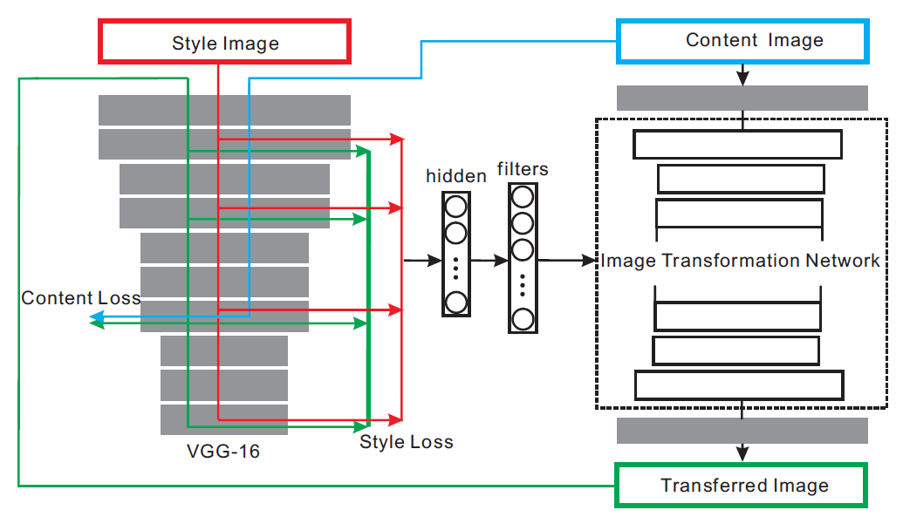

# metaStyleTransfer
Pytorch implementation of Meta Networks for Neural Style Transfer.

This is the Pytorch implementation of Meta Networks for Neural Style Transfer. The meta network takes in the style image and generated an image transformation network for neural style transfer. The original paper referenced can be found [here](https://arxiv.org/abs/1709.04111).

Meta Network Architecture
----
<div align=center>

</div>

### Data
The network is trained on the content images from MS-COCO (Lin et al. 2014) [*train*](http://images.cocodataset.org/zips/train2014.zip) set and the style images from the [*test*](https://www.kaggle.com/c/painter-by-numbers) set of the WikiArt dataset (Nicol. 2016). There are about 80k images in MSCOCO *trainval* set and about 80k images in the *test* set of WikiArt.

### Getting Started
- Clone this repo:
```bash
git clone https://github.com/amanjain1397/metaStyleTransfer.git
cd metaStyleTransfer
```

### Usage
Stylize image
```bash
python main.py eval --content_image </path/to/content/image> --content_size 256 --model </path/to/saved/model> --output-image </path/to/output/image> --cuda 1
```
* `--content-image` path to content image you want to stylize.
* `--content_size` resizing the content image if memory is an issue 
* `--model` saved model to be used for stylizing the image (eg: `mosaic.pth`)
* `--output_image` path for saving the output image.
* `--cuda` set it to 1 for running on GPU, 0 for CPU. (default is 1)

Train model
```bash
python main.py train --content_dataset </path/to/content_dataset> --style_dataset </path/to/style_dataset> --image_size 256 --batch_size 8 --save_model_dir </path/to/save-model/folder> --epochs 60 --cuda 1
```
* `--content_dataset` path to content images dataset, the path should point to a folder containing another folder with all the training content images
* `--style_dataset`  path to style images dataset, the path should point to a folder containing another folder with all the training style images
* `--image_size` ize of training images, default is 256 X 256
* `--batch_size` batch size for training, default is 8 (applies only to the content images)
* `--epochs` number of training epochs, default is 60
* `--save_model_dir` path to folder where trained model will be saved, default is ./models/
* `--cuda` set it to 1 for running on GPU, 0 for CPU. (default is 1)

Refer to ./main.py for other command line arguments.


