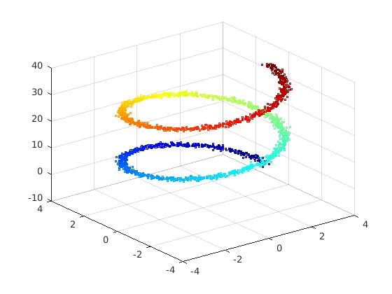
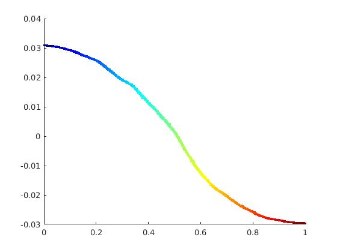
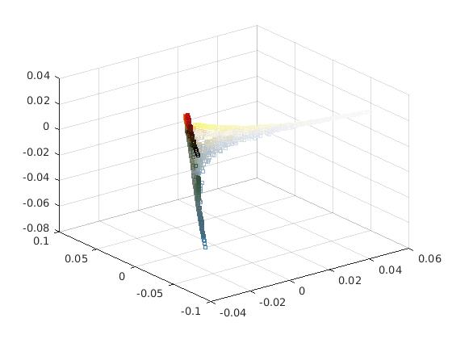
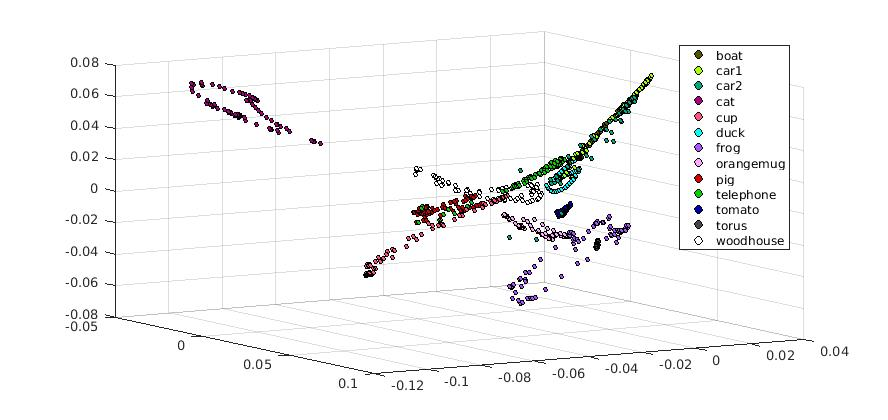

# local_tangent_space_alignment
LTSA, in MATLAB. Like LLE, LTSA is for nonlinear dimension reduction. But, LTSA is a method that constructs a principal manifold.
LTSA, 在 MATLAB 中。像 LLE, LTSA 是非线性降维。但是, LTSA 是一种构造主流形的方法。
A principle manifold, a nonlinear mapping from one euclidean space to another. It's very interesting.
一个原理流形, 从一个欧氏空间到另一个的非线性映射。这很有趣。
For example, given a spiral with gaussian noise we may want to find a 1d curve that describes it.
例如, 给定一个带有高斯噪声的螺旋线, 我们可能希望找到描述它的1d 曲线。

These are the coordinates that were found using LTSA, compared with the [0,1] interval.
这些是使用 LTSA 发现的坐标, 与 [01] 间隔

So, using the same image as for the LLE example, we find this embedding with LTSA:
因此, 使用与 LLE 示例相同的图像, 我们发现此嵌入 LTSA:

And finally, using 13 categories from the COIL-100 dataset, I apply this algorithm with k=100 and receive the following alignment:
最后, 使用 COIL-100 数据集的13类别, 我将此算法应用于 k=100 并接受以下对齐:

