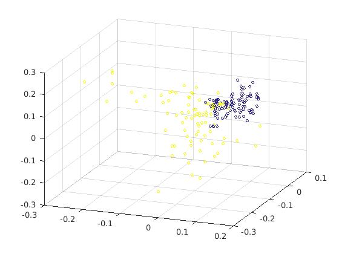

# isomap
IsoMap algorithm in MATLAB, with crappy Floyd-Warshall for all pairs shortest distances.
Used for the face/nonface training set.

MATLAB ISOMAP算法，用蹩脚的Floyd Warshall全对的最短距离。
用于面部/ nonface训练集。
！[图片]（train_set_32 .jpg）
