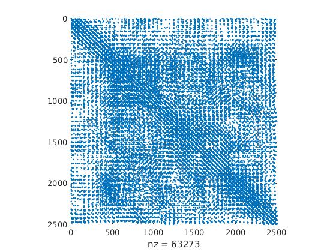
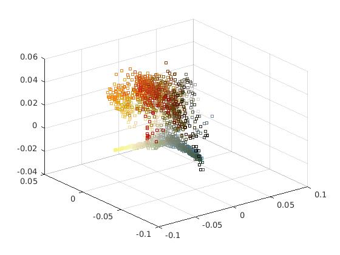

# local_linear_embedding
LLE, in MATLAB, as studied in Saul and Roweis's paper.

So, I applied LLE to vectors formed from the patches of 10x10 from this image:

And the resulting graph (K=20) was encountered.

And finally, the LLE projections:

